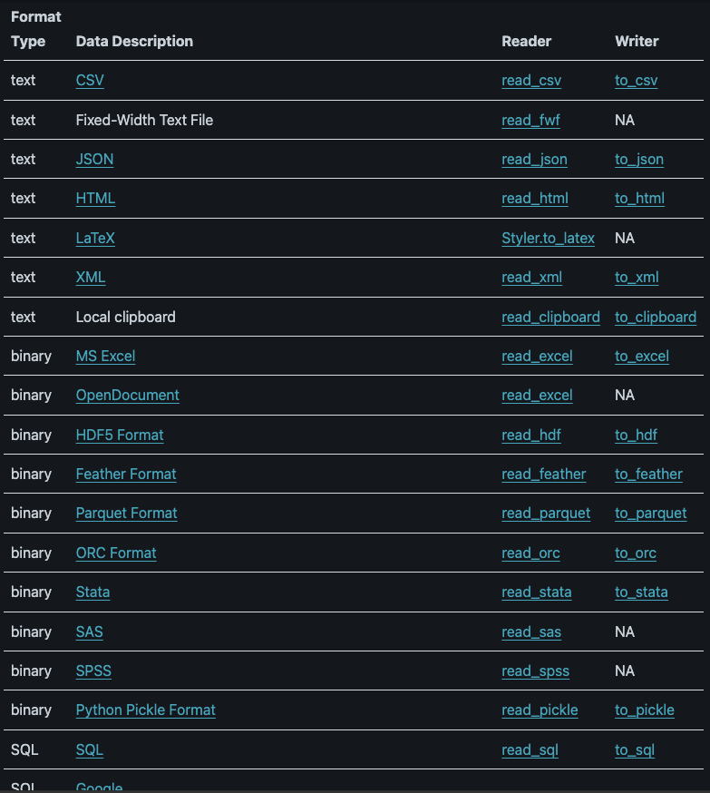
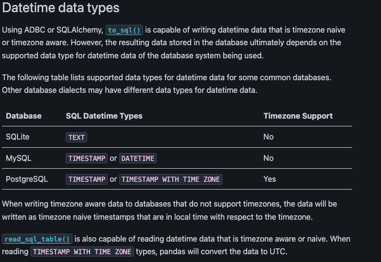
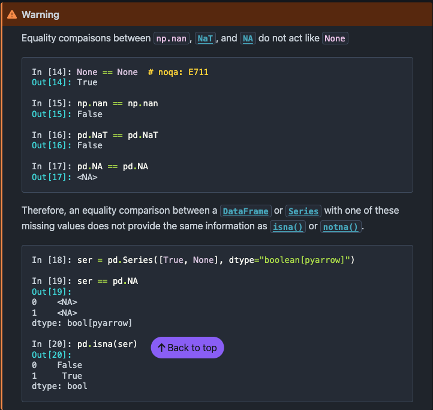
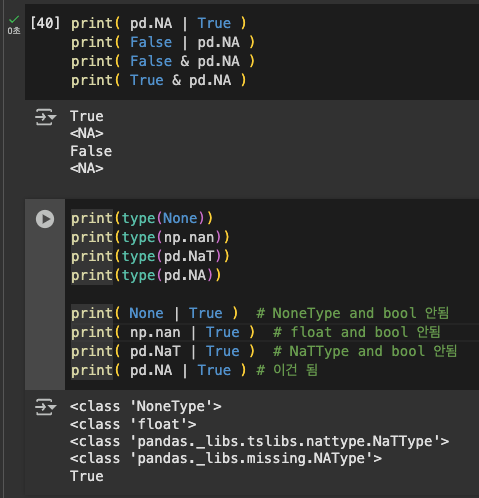

## 날짜: 2025-02-06

### 스크럼
- 학습 목표 1 : Numpy, Pandas 복습하기
- 학습 목표 2 : csv 공부하기

### 새로 배운 내용
#### 주제 1: csv 형태로 다루는 방법
- csv 파일을 numpy와 pandas 2가지 방법으로 모두 읽을 수 있는데<br>
    pandas 형태로 읽어와서 np로 변환하여 사용하는 등의 작업을 하는게 좋아보인다
    ``` python
    # NumPy 방법
    np.loadtxt('new_file.csv')
    
    # Pandas 방법
    x = pd.read_csv('music.csv', usecols=['Artist', 'Plays']).values
    ```

#### 주제 2: Pandas의 IO tools

- IO가 되게 다양하게 지원되고 있다
- csv, json, xml 정도만 생각하고 있었는데 까먹고 있던 SQL도 보였고<br>
    이 외에도 html(?), excel, Pickle, Google(?) 등 다양하게 있다
    - html : read에 옵션이 여럿 있던데, 눈에 띄는 부분은 request url을 입력받는 경우 HTTP 헤더를 파싱하는 거 같다 (신기)<br>
    - Pickle : 여기 내용을 읽다가 Dataframe.to_pickle, Series.to_pickle로 나눠진 걸 보고<br>
            저장할 때 저렇게 지정해서 하는 방법도 유용할 거 같다고 느꼈다
    - SQL : Datetime 저장과 관련하여 내용이 있는데, 어떤 DB를 사용하는가에 따라 특정 데이터들의 저장 방식이 달라지니, 이런 점에서 타입에 주의해야할 필요성을 알 수 있었다.<br>
    

#### 주제 3: Pandas의 Missing Data 종류

- Missing의 종류가 4가지가 있는데 None을 제외하고는 직접 비교가 안된다
- 그래서 isna(), notna()를 활용한다<br>
    isna() - None, np.nan, pd.NaT, pd.NA 모두 True로 잘 된다
- pd.NA의 연산이 특이한데, 아래와 같이 혼자만 논리 연산이 되는 모습을 보인다.<br>
    특이하게 or True, and False는 되지만, and True와 or False는 'NA'로 잡아먹는(?)거 같다
    

### 오늘의 도전 과제와 해결 방법
- X (굳이 있다고 하면 Pandas 추가 학습 한 거)

### 오늘의 회고
- Pandas의 기본적인 연산들을 찾아보고, IO 활용을 공부해보면서 다양한 방식이 존재하는다는 것을 알 수 있었다
- 실제 데이터를 다룰 때 Missing Data를 잘 처리해야 좋은 학습이 가능할 거 같아서 이 부분을 잘 알아야 할 거 같다
- 다음 주 내용이 잘 모르는 내용들이던데 주말에 미리 공부해두고 수업 때 한번 더 복습하는 걸 목표로 하면 좋을듯하다

### 참고 자료 및 링크
- [Pandas - IO tools](https://pandas.pydata.org/docs/user_guide/io.html#io-sql)
- [Pandas - Missing Data](https://pandas.pydata.org/docs/user_guide/missing_data.html)