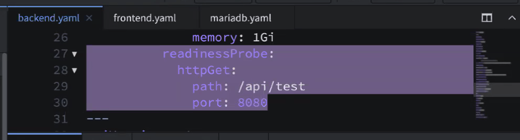

## 날짜: 2025-02-11

### 스크럼
- 학습 목표 1 : 미니퀘스트 하기
- 학습 목표 2 : 특강 내용 되짚어보기

### 새로 배운 내용
#### 주제 1: Krampoline
- 카카오에서 사용하는 배포 프로그램(?) 가이드라인(?) 같은 ide
- git 사용을 vscode, source tree 등에서 간단하게 gui를 통해 하는 것처럼 
    docker를 넘어서 쿠버네티스 환경을 간단하게 사용해볼 수 있는 좋은 툴인거 같다
- **중요한거 같음**
  
  - Pod(po가 cli창 이름인거 같음)가 여러 개 묶인 ReplicaSet이 있음
    - 이 ReplicaSet에 Pod로 frontend, backend, DB를 도커이미지를 포함한 컨테이너로 만들어서 달 수 있음 (Pod가 컨테이너, 그 안에 각각 front, back, DB 이미지를 따로 1개씩 넣어서 3개) 
    - 이 ReplicaSet 하위의 Pod는 각각 **준비 상태**가 있는데 준비 완료가 안되면 얘는 아직 돌리면 안된다로 판단되는거 같음
  - 위 사진에서 httpGet: 하위의 path: 와 port:가 있는데 
    저 uri와 port로 들어오는 http status code를 보고 200 등 정상이면 얘를 준비상태로 인식하겠다는 yaml 설정이라고 함
    - 즉, 저 **path, port를 우리가 나중에 쓸 걸로 바꾸는게 중요하다**는 얘기
- Pod 상태 확인하기
  - kubectl get po 명령어
    - 이렇게 하면 각 Pod가 준비가 되었는지를 볼 수 있음
  - 더 자세한 명령어 : kubectl describe po 'pod id'
    - 좌측의 gui에서 로그보기를 눌러서 비슷하게 상세 기록을 볼 수 있음
  - 이렇게 확인해서 pod의 준비가 다 잘 되었고, **이미지 경로 또한 완료**된 상태에서 
    좌측 상단의 "배포하기"를 눌러서 반영할 수 있음
    - 아마 배포하기 이전에 github repository에 반영이 되도록 
        **main 브랜치에 push** 해줘야 하는 걸로 알고 있음
- ConfigMap, Secret
  - 해당 내용은 아래 링크에 있음
  - 한번 읽어보기는 했는데 예제를 보고 원하는 커스텀을 바로 하는건 많이 어려울 거 같다(배경지식 이슈)
  - 일단 k8s/kustomization.yaml 파일을 읽고 그 파일에 적힌 다른 yaml 파일을 읽는 방식으로 여러 yaml을 확인할 수 있다는 점 
    이 kustomization에 내가 원하는 기능을 담은 yaml을 불러와서 대체할 수도 있다는 점이 좋은거 같다
  - Secret은 아마 .env와 비슷한 역할을 하는 거 같다
- Deployment, Ingress
  - 전체적인 큰 틀을 잡아보면 
    1) 사용자 Client가 접근
    2) 클러스터 가장 앞에 있는 Ingress와 만남
       1) 원래는 1 -> 2 사이에 Ingress 로드 밸런스 매니저가 위치해서 조절을 한 번 더 해주는거 같음
       2) Ingress가 있고 없고의 차이는
          1) Ingress가 없으면 그 안의 앱이 다른 포트를 가져야 되는데
          2) 있으면 Ingress가 알아서 나눠줘서 하나의 포트로 접근이 됨
    3) 그러면 Ingress를 지나서 클러스터 내부로 들어오게 되고, 
        일정한 규칙에 따라 Service로 이동 (Service는 실행 중인 앱이 추상화된 것)
    4) 그러면 Service에서 ReplicaSet -> Pod로 이동하게 됨 (Pod로 간다가 맞는거 같은데 아마 레플리카셋이 더 큰 단위라 이렇게 말해도 맞는거지 않을까 싶음)
    5) 번외로, ReplicaSet Pod에 대한 업데이트를 선언하는 영역이 **Deployment**임
 
- 그리고 일반적으로는 Docker와 Argo를 사용하는 데 이게 크램폴린에서는 아래와 같이 매칭됨 
    |카카오 크램폴린|일반적인 이름|
    |:-:|:-:|
    |Kargo|Argo CD|
    |D2HUB|Docker Hub|
    |DKOS|Kubernetes 클러스터|

#### 주제 2: loc
- 사실상 복습에 가깝긴 한데, 개인적인 생각으로 apply를 사용하는 것보다 loc을 이용하는게 좋은거 같다
- 테스트를 해보지 않아 확신은 없지만, apply에 lambda를 섞어쓰면 보기 편하긴 한데 벡터 연산이 아니라 좀 느리지 않을까 하는 생각이 들었다
- 반면 loc을 이용하면 요구사항이 길어지는 경우 보기가 조금 귀찮(?)을수도 있지만, pandas 자체가 벡터 연산이니 apply보다는 빠르지 않을까 하는 생각이 들었다

### 오늘의 도전 과제와 해결 방법
- 도전 과제 1: 미니퀘스트 하기 (진행 중)
- 도전 과제 2: 크램플린 복습하기 (하긴 했는데 실습은 제대로 못해봤다)
  - 개념은 사용자 메뉴얼을 찾아서 개념들을 복습했고, 실습은 아직 제대로 못해봤다 (따라 눌러보기 정도? 배포는 안했다)

### 오늘의 회고
- 미니퀘스트를 해보면서 느낀 점
  - 생각보다 loc으로 하면 편해지는 코드가 많은거 같다
  - 의외로(?) 간단한 코드를 loc으로 대체하면 굳이 lambda를 쓰는 일이 잘 안 생기는거 같다 (아마도?)
  - df[...] 이런식으로 하는 경우 Series가 보통 반환이 되는데 
    이때 View로 반환되기 때문에 저 df[...]에 값 변형을 줘도 df는 달라지지 않는다
    - 그래서 inplace=True를 쓰거나, loc을 통해 직접 변형을 넣어주는게 좋은거 같다
- Krampoline을 듣고 느낀 점
  - Docker도 잘 사용하는 편은 아니지만 간단히 yaml 파일을 작성해서 EC2 배포는 천천히하면 할 수는 있어서 사용법 자체는 어느 정도 알 거 같긴 했다. 
    (git 연동하고, k8s에 커스터마이즈 적고, 그렇게 인식하면 되겠지? 하는 느낌)
  - 이제 문제가, 쿠버네티스는 잘 모르는 내용이다보니 대략 이렇구나~ 하는 정도는 알겠지만, 
    실제 원하는 기능을 커스텀해서 사용하지는 못할 거 같다. 
  - 특히, 인공지능 파트가 개발한 모델을 사용자와 상호작용하도록 하는 백엔드 파트와, 
    모델이 배포된 환경에서도 잘 작동하도록 클라우드 파트 둘 다 어느정도 이해해야 개발할 때 편할거 같아서 고민이 더 생기는 거 같다
- 배포와 관련해서
  - 사실 학교 시절에 배포는 자주 하지 않고, 로컬 환경에서 혹은 같은 네트워크 안에서 프론트와 백엔드가 맞물리는가  
    접속이 되는가 정도만 했었기 때문에 실제 배포 환경에 대한 걱정이 좀 많은거 같다
  - 이번 크램플린을 통해 배포에 대해 개념을 잡고 이것저것 만져보면서 궁금했던 내용들을 하나씩 실습해보는게 좋을 거 같다

### 참고 자료 및 링크
- [크램폴린IDE 도움말](https://krampoline-help.goorm.io/)
- [ConfigMap, Secret](https://krampoline-help.goorm.io/ide/kakao-cloud/dkos/ide-configmap-secret)
